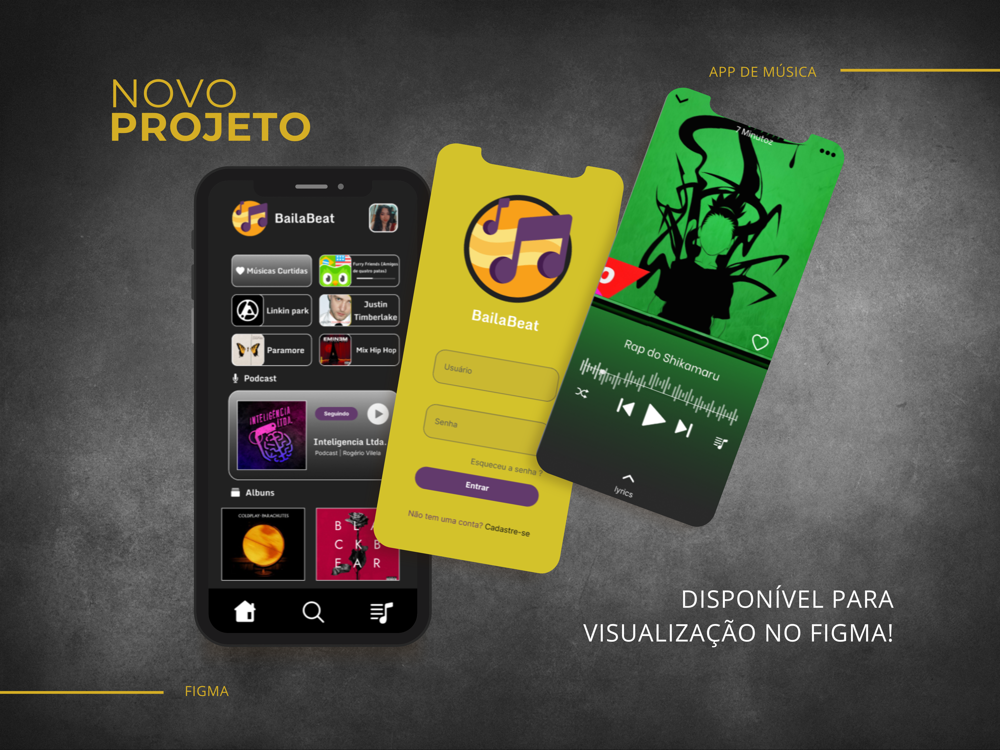
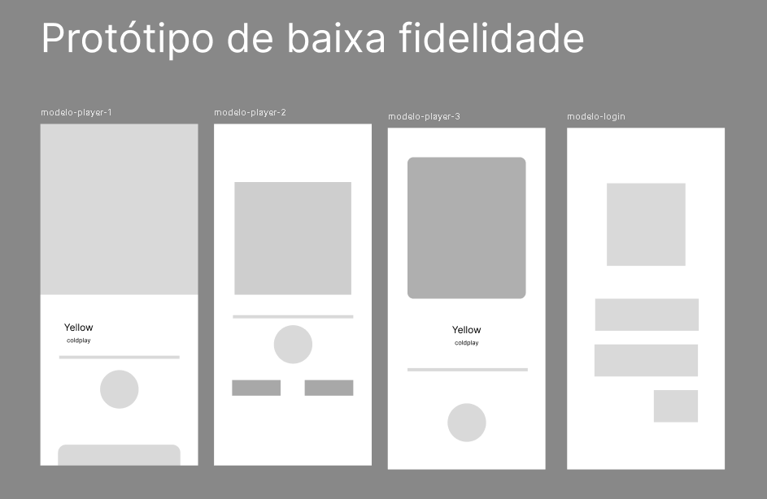
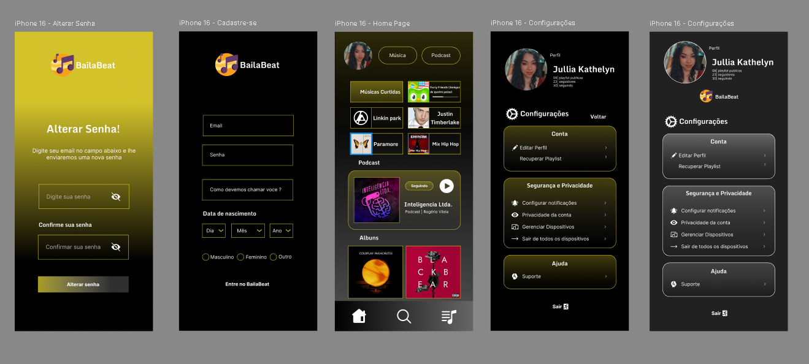
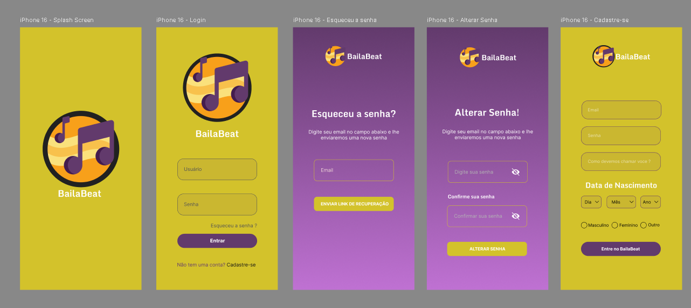
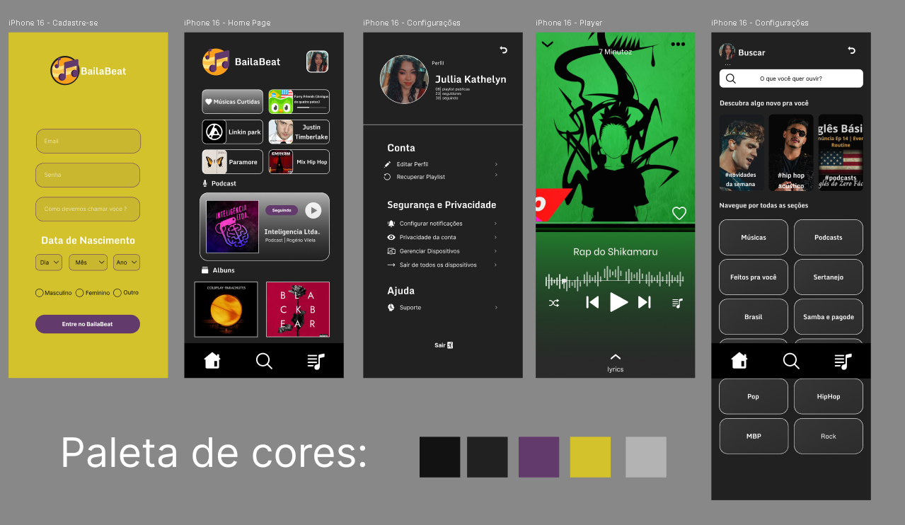

# 🎵 Figma-BailaBeat - Protótipo de Aplicativo de Música
Protótipo BailaBeat inspirado em plataformas famosas, desenvolvido durante o curso PROPROFISSÃO no Instituto PROA. O projeto foi desenvolvido no Figma, passando por etapas de baixa fidelidade, testes de cores e design, e uma versão final de alta fidelidade.

[Figma - BailaBeat](https://www.figma.com/design/obwXvWp4eUeGA3J3ZrL8Gs/BailaBeat?node-id=0-1&t=1hIB4xjqxtljeKYv-1) <– Clique para ver o protótipo

BailaBeat é um protótipo de aplicativo de música inspirado em plataformas famosas como Spotify e Deezer. O projeto foi desenvolvido como parte do curso **PROPROFISSÃO** no **Instituto PROA**, com o objetivo de aplicar conceitos de design de interface e experiência do usuário.

## ✨ Objetivo

Criar a interface de um aplicativo de música funcional, intuitiva e moderna, utilizando a ferramenta Figma e seguindo etapas fundamentais do processo de prototipagem.

## 🛠️ Etapas do Projeto

- **Prototipagem de Baixa Fidelidade**  
  Estrutura inicial das telas e definição do fluxo de navegação.

  

- **Testes de Cores e Design**  
  Exploração visual com diferentes paletas de cores, tipografia e estilos visuais.

  

- **Prototipagem de Alta Fidelidade**  
  Versão final refinada com interface realista e interações simuladas.

  
  

## 🌈 Documentação de cores

| Cor               | Hexadecimal                                                |
| ----------------- | ---------------------------------------------------------------- |
| Preto       |  #121212 |
| Cinza      |  #212121 |
| Roxo      |  #623A6C |
| Amarelo      | #D3C22B |
| Cinza claro     |  #B3B3B3 |

## 🖼️ Ferramenta Utilizada

- [Figma - BailaBeat](https://www.figma.com/design/obwXvWp4eUeGA3J3ZrL8Gs/BailaBeat?node-id=0-1&t=1hIB4xjqxtljeKYv-1) <– Clique para ver o protótipo

 ##
 
https://github.com/julliakathelyn
